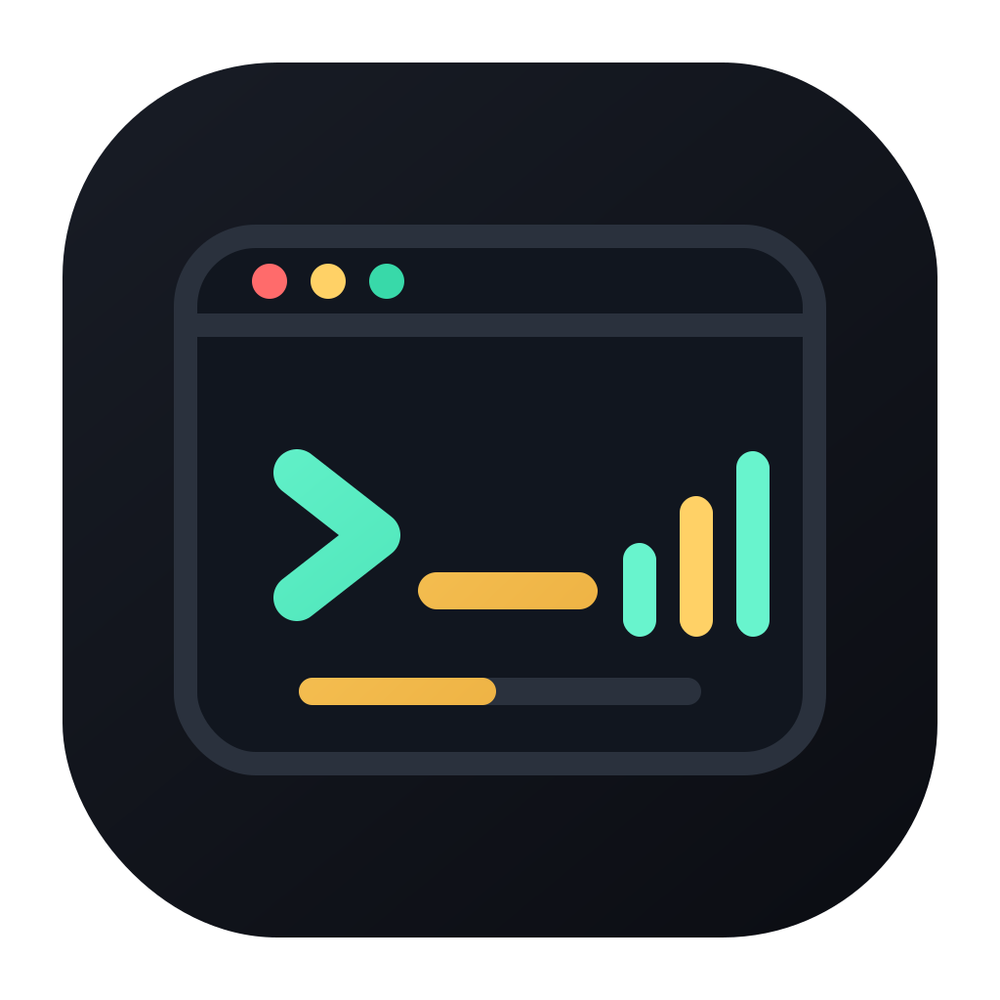

<p align="center">
  
</p>

<h1 align="center">TRT Dinle Terminal Player</h1>

<p align="center">
  TRT Dinle için modern, terminal tabanlı müzik / radyo / podcast / sesli kitap oynatıcısı. Klavye odaklı bir TUI deneyimi.
</p>

<p align="center">
  <b>Python</b> · <b>Textual</b> · <b>mpv</b> · <b>TRT Dinle</b>
</p>

---

## Tanıtım Videosu

https://github.com/user-attachments/assets/1b268d50-029b-42e2-83b9-5b7a2679a36e

---

## Özellikler

- **TRT Dinle içerikleri**: Müzik, radyo tiyatrosu, sesli kitap, podcast ve canlı radyo içeriklerine terminalden erişim.
- **Modern TUI arayüzü**: Textual ile klavye odaklı, hızlı ve temiz terminal deneyimi.
- **Sütunlu listeler**: `No · Başlık · Sanatçı · Süre` düzeninde okunabilir içerik listeleri.
- **Tam oynatıcı ekranı**: Progress bar, spectrum, volume, shuffle, repeat, queue ve favori kontrolleri.
- **Animasyonlu spectrum**: Terminal içinde canlı ses görselleştirme.
- **Favoriler**: Beğenilen içerikleri yerel olarak kaydeder.
- **Geçmiş**: Daha önce açılan sayfaları ve içerikleri takip eder.
- **Cache sistemi**: Sayfa verilerini belli süre saklayarak tekrar yüklemeleri hızlandırır.
- **Uyku zamanlayıcısı**: Belirli süre sonra oynatmayı durdurmak için timer desteği.

---

## Klasör Yapısı

```text
trt_dinle/
├─ trtdinle_app.py              # Ana uygulama
├─ requirements.txt             # Python bağımlılıkları
├─ libmpv-2.dll                 # Windows için mpv runtime dosyası
├─ README.md                    # Bu dosya
└─ src/
   ├─ TRTDinleExplainer.mp4     # Tanıtım videosu
   └─ trtdinle_logo_clean.svg   # Logo
```

---

## Sıfırdan Kurulum

Bu bölüm hiç kurulum yapmamış kullanıcılar içindir.

### 1. Python Kur

Uygulama için **Python 3.10 veya üzeri** önerilir.

Kontrol etmek için:

```bash
python --version
```

Bazı sistemlerde komut şu olabilir:

```bash
python3 --version
```

Python yoksa:

- Windows: https://www.python.org/downloads/
- macOS: `brew install python`
- Ubuntu / Debian: `sudo apt install python3 python3-pip python3-venv`

> Windows kurulumunda **“Add Python to PATH”** seçeneğini işaretleyin.

---

### 2. mpv / libmpv Kur

Uygulama ses oynatmak için `mpv` kullanır.

#### Windows

Bu pakette `libmpv-2.dll` dosyası ana klasörde hazır gelir. Genelde ekstra işlem gerekmez.

Eğer uygulama `mpv` veya `libmpv` hatası verirse:

1. mpv Windows build indirin: https://sourceforge.net/projects/mpv-player-windows/
2. `mpv.exe` ve ilgili DLL dosyalarını proje klasörüne veya PATH içindeki bir klasöre koyun.

#### Ubuntu / Debian

```bash
sudo apt update
sudo apt install mpv
```

#### Arch Linux

```bash
sudo pacman -S mpv
```

#### Fedora

```bash
sudo dnf install mpv
```

#### macOS

```bash
brew install mpv
```

---

### 3. Projeyi İndir ve Klasöre Gir

ZIP olarak indirdiyseniz dosyayı çıkarın ve klasöre girin:

```bash
cd trt_dinle
```

Git ile kullanıyorsanız:

```bash
git clone https://github.com/Vyr0-the-dev/trt-dinle-terminal
cd trt_dinle
```

---

### 4. Sanal Ortam Oluştur

Bu adım sistem Python’unu kirletmemek için önerilir.

#### Windows PowerShell

```powershell
python -m venv .venv
.\.venv\Scripts\Activate.ps1
```

Eğer PowerShell izin hatası verirse:

```powershell
Set-ExecutionPolicy -Scope Process -ExecutionPolicy Bypass
.\.venv\Scripts\Activate.ps1
```

#### Windows CMD

```bat
python -m venv .venv
.venv\Scripts\activate.bat
```

#### Linux / macOS

```bash
python3 -m venv .venv
source .venv/bin/activate
```

Aktif olduğunda terminal başında genelde `(.venv)` görünür.

---

### 5. Python Paketlerini Kur

```bash
pip install --upgrade pip
pip install -r requirements.txt
```

Linux / macOS üzerinde `pip` yerine `pip3` gerekirse:

```bash
pip3 install -r requirements.txt
```

---

### 6. Uygulamayı Çalıştır

Windows:

```powershell
python trtdinle_app.py
```

Linux / macOS:

```bash
python3 trtdinle_app.py
```

---

## Hızlı Kullanım

Ana ekranda:

- `↑` / `↓`: Menüde gez
- `Enter`: Seç
- `p`: Oynatıcı ekranını aç
- `/`: Arama alanına odaklan
- `Esc`: Geri / çıkış

Oynatıcıda:

- `Space`: Oynat / duraklat
- `←` / `→`: 10 saniye geri / ileri sar
- `+` / `-`: Ses artır / azalt
- `n`: Sonraki parça
- `b`: Önceki parça
- `s`: Shuffle aç / kapat
- `r`: Repeat modu değiştir
- `m`: Sessize al
- `f`: Favoriye ekle / çıkar
- `t`: Uyku zamanlayıcısı
- `l`: Yan listeyi aç / kapat
- `?`: Yardım

---

## Tuş Atamaları

### Ana Ekran

| Tuş | İşlev |
|---|---|
| `↑` / `↓` | Menüde gezin |
| `Enter` | Seç |
| `p` | Oynatıcıyı aç |
| `Ctrl+R` | Cache temizle |
| `Ctrl+L` | Geçmişi temizle |
| `Esc` | Çıkış / geri |

### Koleksiyon / Liste Ekranı

| Tuş | İşlev |
|---|---|
| `↑` / `↓` | Listede gezin |
| `Enter` | İçeriği aç / oynat |
| `/` | Ara |
| `f` | Favoriye ekle / çıkar |
| `p` | Oynatıcıyı aç |
| `Esc` / `q` | Geri |

### Oynatıcı

| Tuş | İşlev |
|---|---|
| `Space` | Oynat / duraklat |
| `←` / `→` | 10 saniye geri / ileri |
| `+` / `-` | Ses ayarı |
| `n` | Sonraki parça |
| `b` | Önceki parça |
| `s` | Karışık mod |
| `r` | Tekrar modu |
| `m` | Sessiz |
| `f` | Favori |
| `d` | Kuyruktan kaldır |
| `l` | Yan panel |
| `t` | Uyku zamanlayıcı |
| `/` | Kuyrukta ara |
| `?` | Yardım |
| `Esc` / `q` | Geri |

---

## Veriler Nerede Saklanır?

Uygulama bazı yerel dosyaları kullanıcı klasöründe saklar:

```text
~/.trtdinle_history.json
~/.trtdinle_cache.json
~/.trtdinle_favorites.json
```

Bunlar geçmiş, cache ve favori kayıtlarıdır. Silerseniz uygulama yeniden oluşturur.

---

## Sorun Giderme

| Sorun | Çözüm |
|---|---|
| `ModuleNotFoundError` | `pip install -r requirements.txt` komutunu tekrar çalıştırın. |
| `No module named textual` | Sanal ortam aktif mi kontrol edin, sonra bağımlılıkları kurun. |
| `mpv not found` | mpv kurulu mu ve PATH’te mi kontrol edin. |
| `libmpv` hatası | Windows’ta `libmpv-2.dll` dosyasının `trtdinle_app.py` ile aynı klasörde olduğundan emin olun. |
| Ses gelmiyor | Sistem ses çıkışını ve mpv kurulumunu kontrol edin. |
| İçerik yüklenmiyor | İnternet bağlantısını ve TRT Dinle erişimini kontrol edin. |
| PowerShell venv açılmıyor | `Set-ExecutionPolicy -Scope Process -ExecutionPolicy Bypass` çalıştırın. |

---

## Geliştiriciler İçin

Bağımlılıkları güncellemek:

```bash
pip freeze > requirements.txt
```

Uygulamayı geliştirme modunda çalıştırmak:

```bash
python trtdinle_app.py
```

Kodun ana bölümleri:

- `PlayerEngine`: mpv tabanlı oynatma motoru
- `HomeScreen`: ana ekran
- `CollectionScreen`: kategori / liste ekranı
- `PlayerScreen`: tam oynatıcı ekranı
- `Spectrum`: terminal spectrum görselleştirici

---

## Lisans

MIT

---

<p align="center">
  <sub>Yapımcı: <a href="https://github.com/Vyr0-the-dev">Vyr0-the-dev</a></sub>
</p>
